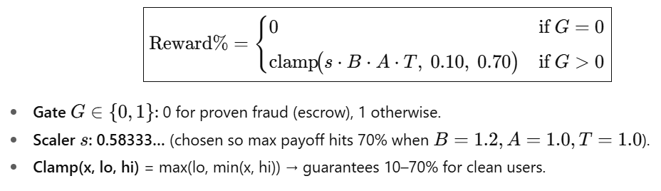
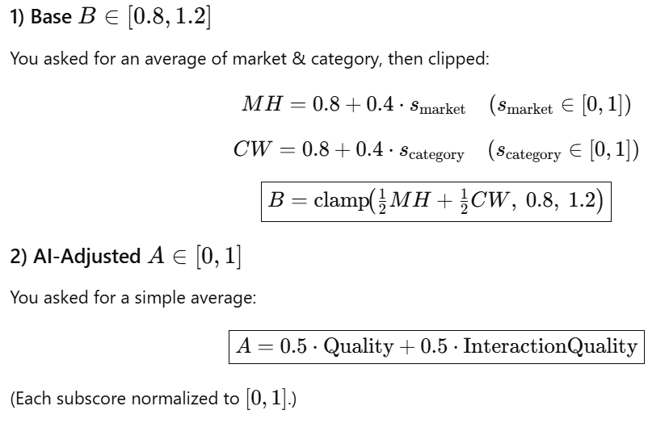
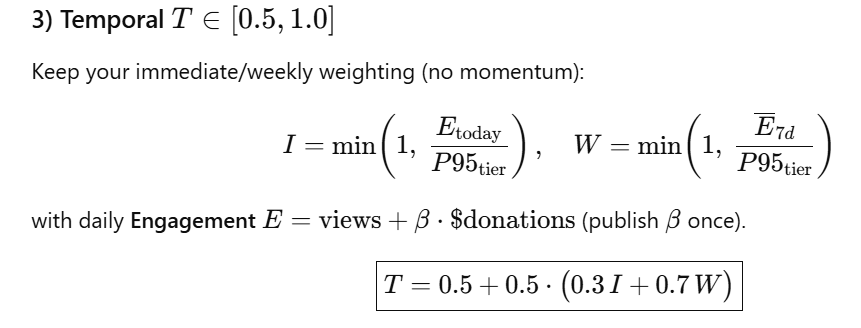

# Jammerz

Jammerz is a web application that showcases a transparent creator economy for TikTok influencers. Creators can track earnings, reinvest coins, borrow against future payouts, and visualize how rewards are calculated.

## Tech Stack

- **React 18** with **TypeScript**
- **Vite** for fast development and bundling
- **shadcn/ui** and **Radix UI** primitives
- **Tailwind CSS** with `tailwind-merge` and `tailwindcss-animate`
- **TanStack Query** for data fetching
- **Recharts** for interactive charts

## Getting Started

### Prerequisites

- Node.js 18 or later
- npm

### Installation

```bash
npm install
```

### Development Server

```bash
npm run dev
```

The app will be available at `http://localhost:8080` with hot module reloading.

### Production Build

```bash
npm run build
npm run preview
```

### Linting

```bash
npm run lint
```

## Project Structure

- `src/` – application source code
- `public/` – static assets
- `index.html` – app entry point and meta tags
- `vite.config.ts` – build and dev server configuration

## Dynamic Scoring Formula




## About

This project is an original implementation of a creator-focused financial dashboard built for experimentation and learning.

